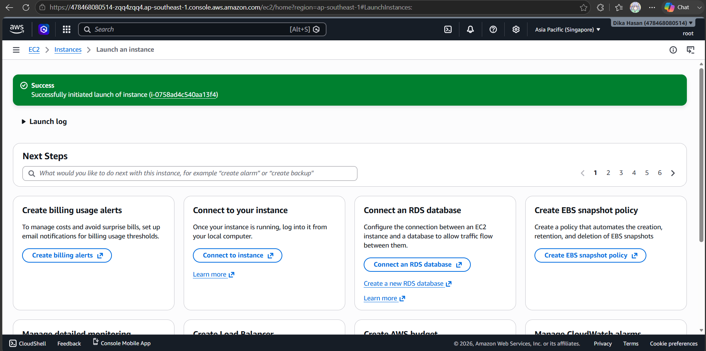
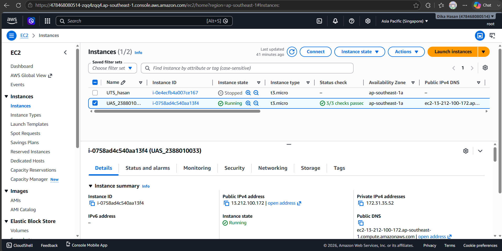
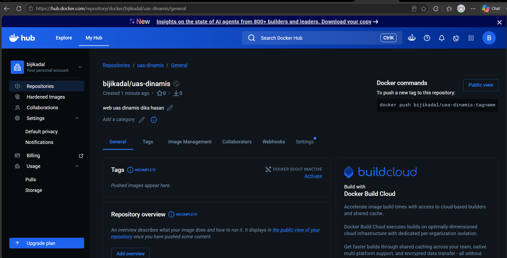
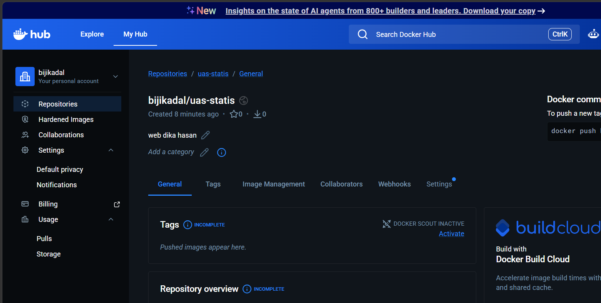
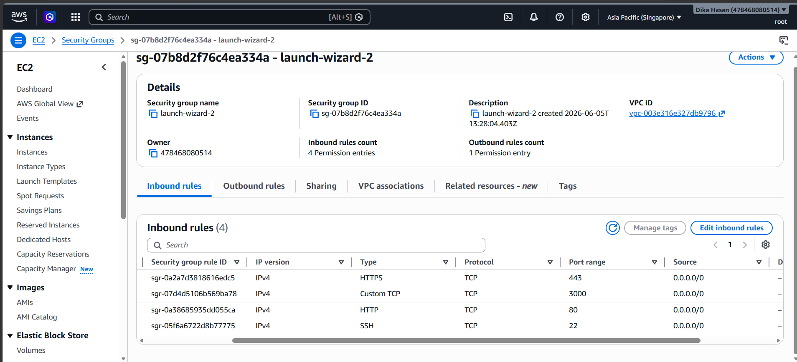
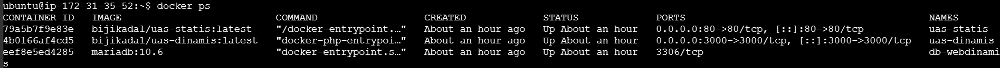
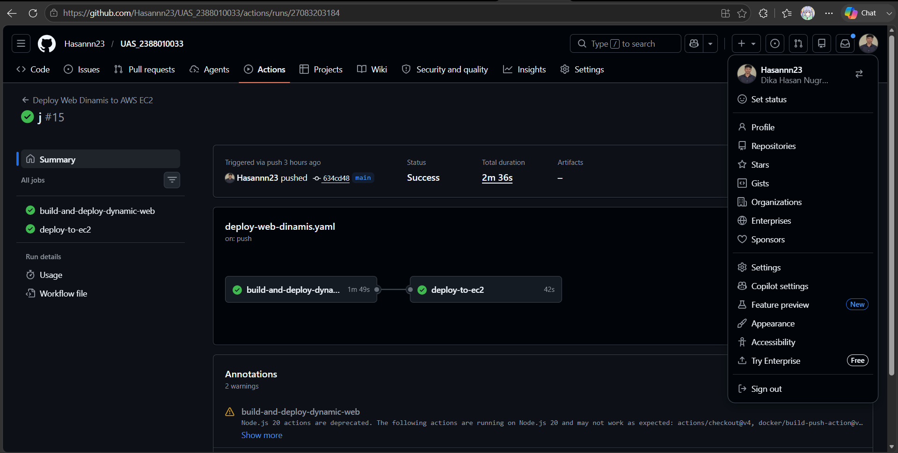
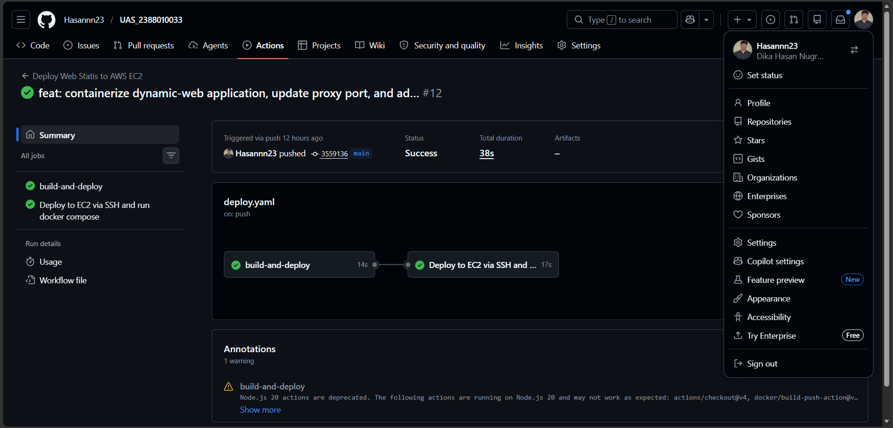
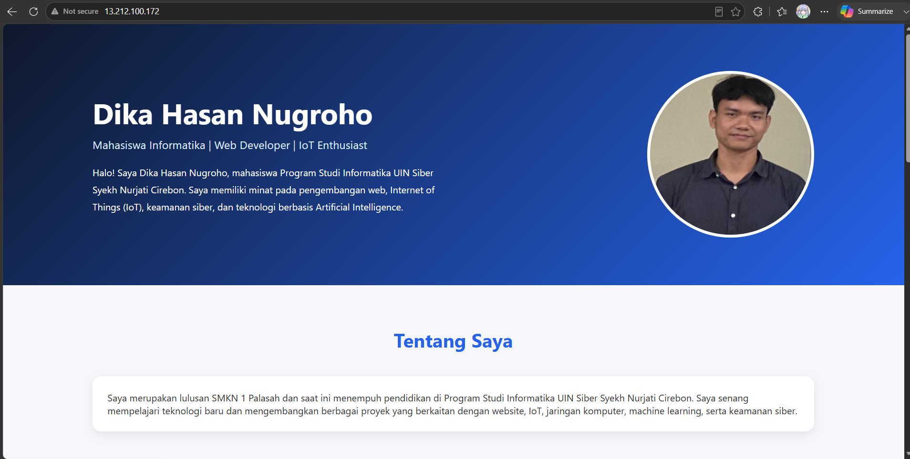
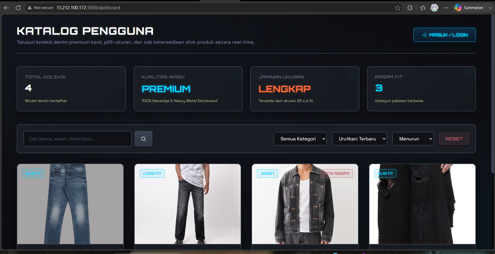

# Inisiasi Instance Baru

   1. buat instance di aws dengan Nama Instance: UAS-2388010033
   
   2. OS Image: Ubuntu Server 22.04 LTS
   3. Key Pair: Menggunakan key .pem baru yang disimpan secara aman untuk akses SSH GitHub Actions. 
   
   4. membuat repo di docker untuk dinamis dan statis 
   
   

# Konfigurasi Security Group (Firewall)
   Untuk memastikan lalu lintas jaringan dapat diakses publik namun tetap aman, Security
   Group (Inbound Rules) telah dikonfigurasi sebagai berikut:
   1. Port 22 (SSH): Diizinkan agar GitHub Actions dapat masuk ke server untuk mengeksekusi script deployment.
   2. Port 80 (HTTP): Dibuka secara publik (0.0.0.0/0) agar web dapat diakses oleh browser.
   

# Konfigurasi Kontainer Laravel (Web Dinamis)

   Aplikasi dinamis dibangun menggunakan PHP dan framework Laravel. Dockerfile dirancang menggunakan base image php:8.2-fpm dengan instalasi Composer di dalamnya.

   Berikut adalah Dockerfile yang digunakan untuk Laravel:

   1. Stage 1: Build frontend assets
   FROM node:20-alpine AS frontend-builder
   WORKDIR /app
   COPY package.json package-lock.json* ./
   RUN npm install
   COPY . .
   RUN npm run build

   # Stage 2: Run the Laravel application
   FROM php:8.4-cli-alpine
   WORKDIR /var/www/html

   # Install system dependencies & PHP extensions
   RUN apk add --no-cache \
      mysql-client \
      libpng-dev \
      libjpeg-turbo-dev \
      freetype-dev \
      zip \
      libzip-dev \
      unzip \
      git \
      oniguruma-dev \
      bash \
      && docker-php-ext-configure gd --with-freetype --with-jpeg \
      && docker-php-ext-install pdo_mysql gd zip mbstring bcmath

   # Install Composer
   COPY --from=composer:latest /usr/bin/composer /usr/bin/composer

   # Copy application files
   COPY . .

   # Copy environment file
   RUN cp .env.example .env

   # Copy Vite built assets from Stage 1
   COPY --from=frontend-builder /app/public/build ./public/build

   # Set permissions
   RUN chown -R www-data:www-data storage bootstrap/cache

   # Install composer dependencies (using --no-scripts to prevent execution of artisan commands during build, and --ignore-platform-reqs for alpine compatibility)
   ENV COMPOSER_ALLOW_SUPERUSER=1
   RUN composer install --no-interaction --optimize-autoloader --no-dev --no-scripts --ignore-platform-reqs

   # Expose port 3000
   EXPOSE 3000

   # Script to run migrations/seeding, discover packages, and start php artisan serve
   CMD php artisan package:discover --ansi && \
      php artisan config:cache && \
      php artisan route:cache && \
      php artisan view:cache && \
      php artisan serve --host=0.0.0.0 --port=3000

# ORKESTRASI DOCKER COMPOSE & JARINGAN
   Penulisan sintaks YAML pada docker-compose.yml memuat pengaturan pemetaan port, volume persisten, dan variabel lingkungan (Environment Variables) agar password tidak ter-ekspos (hardcoded).
   

# HASIL UJI COBA LANGSUNG & ZERO-TOUCH DEPLOYMENT
   commit ke github action
   
   

# Tampilan web statis
   
# Tampilan web dinamis
   

