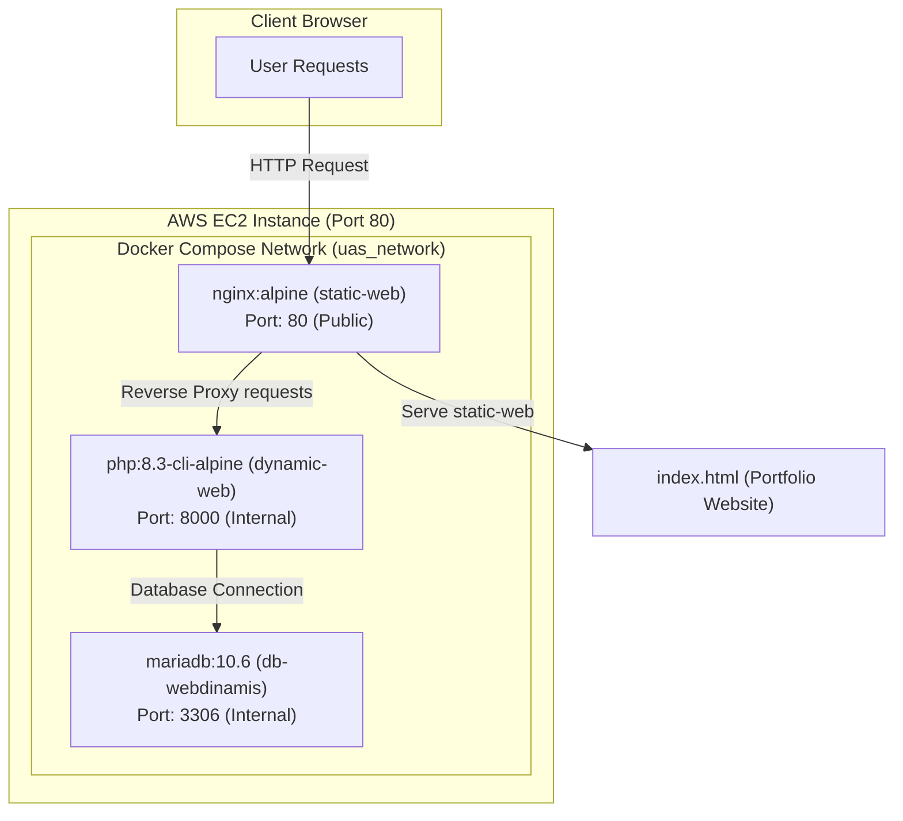

# 🏛️ UAS - Sistem Deployment CI/CD & Orkestrasi Kontainer

Proyek ini merupakan implementasi sistem CI/CD dan orkestrasi kontainer Docker Compose untuk menyajikan dua aplikasi web: **Web Statis** (Web Portfolio & Nginx Reverse Proxy) dan **Web Dinamis** (Aplikasi Manajemen Denim berbasis Laravel) dengan basis data **MariaDB**.

---

## 🗺️ Topologi Arsitektur Sistem

Sistem ini di-deploy menggunakan topologi reverse proxy di dalam jaringan Docker internal AWS EC2 untuk memastikan isolasi data dan keamanan sistem.



---

## ⚙️ Penjelasan Environment & Layanan

Layanan docker-compose dikonfigurasikan dengan standardisasi produksi dan didefinisikan ke dalam 3 container utama:

| Nama Layanan | Nama Container | Image Docker | Port Publik | Port Internal | Deskripsi |
| :--- | :--- | :--- | :--- | :--- | :--- |
| `static-web` | `uas-statis` | `nginx:alpine` | `80` | `80` | Menyajikan Web Statis Portfolio sekaligus bertindak sebagai **Reverse Proxy** untuk meneruskan request dinamis ke container Laravel. |
| `dynamic-web` | `uas-dinamis` | `php:8.3-cli-alpine` | *None* | `8000` | Aplikasi manajemen denim berbasis Laravel yang terisolasi dari akses publik langsung. |
| `db-webdinamis` | `db-webdinamis` | `mariadb:10.6` | *None* | `3306` | Basis data MariaDB yang menyimpan data pengguna dan inventaris denim secara persisten. |

---

## 🔒 Fitur Keamanan & Desain Jaringan

1. **Zero Public Port exposure for Database & App**: Port database `3306` dan port Laravel `8000` **TIDAK** diekspos ke publik. Hanya port `80` milik Nginx yang terbuka secara eksternal.
2. **Docker Network Isolation**: Semua container berjalan di dalam `uas_network` sehingga komunikasi antar-layanan menggunakan DNS internal (contoh: Laravel menghubungi database menggunakan host name `db-webdinamis` bukan IP hardcoded).
3. **Kredensial Aman**: Rahasia database dilindungi menggunakan Environment Variables yang diinjeksikan langsung melalui Docker Compose.

---

## 🚀 Otomasi Basis Data (Auto-Seeding)

Saat container database pertama kali dinyalakan, skema basis data dan data benih (seed data) akan di-import secara otomatis dari berkas SQL lokal ke MariaDB melalui direktori inisialisasi:
- Berkas SQL lokal: `db_data/uas33.sql`
- Target Container: `/docker-entrypoint-initdb.d/`

Berkas SQL tersebut mencakup skema tabel `users`, `products`, `password_reset_tokens`, `sessions`, dan data benih pengguna admin default:
- **Email Admin:** `admin@denim.com`
- **Kata Sandi:** `admin123`

---

## 🛠️ Pipeline CI/CD (GitHub Actions)

Kami memisahkan proses pipeline menjadi dua berkas workflow YAML independen menggunakan teknik **Paths Filter** untuk menghindari pemborosan resource runner GitHub:

1. **Web Statis Pipeline (`deploy.yaml`)**:
   - Berjalan hanya jika ada perubahan di direktori `static-web/` atau berkas workflow itu sendiri.
   - Melakukan build & push image `uas-statis` ke Docker Hub, melakukan SSH ke EC2, melakukan penarikan git terbaru, dan me-restart container `uas-statis`.
2. **Web Dinamis Pipeline (`deploy-web-dinamis.yaml`)**:
   - Berjalan hanya jika ada perubahan di direktori `dynamic-web/`, berkas `docker-compose.yml`, atau berkas workflow itu sendiri.
   - Melakukan build & push image `uas-dinamis` ke Docker Hub, melakukan SSH ke EC2, melakukan penarikan git terbaru, me-restart seluruh layanan, menunggu database siap, dan melakukan verifikasi struktur tabel database.

---

## 🌐 Tautan AWS & Dokumentasi Keberhasilan

- **IP Publik AWS EC2:** `http://<MASUKKAN_IP_AWS_DI_SINI>`
- **Log Deployment Berhasil (GitHub Actions):**
  Status build dan push ke Docker Hub berjalan sukses dengan status centang hijau sempurna di GitHub Actions untuk kedua layanan.

---

## 📖 Cara Menjalankan Secara Lokal

1. Pastikan Anda telah menginstal **Docker** dan **Docker Compose**.
2. Clone repositori ini dan masuk ke direktori utama.
3. Jalankan perintah berikut untuk membangun dan memulai seluruh layanan:
   ```bash
   docker compose up --build -d
   ```
4. Buka browser dan akses:
   - Web Statis Portfolio: `http://localhost/`
   - Halaman Login (Laravel): `http://localhost/login`
5. Masuk menggunakan akun admin:
   - Email: `admin@denim.com`
   - Password: `admin123`
